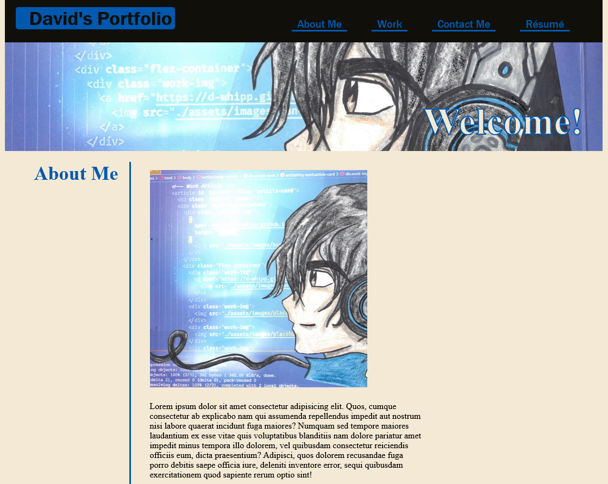

# Second Coding Bootcamp Challenge: Personal Portfolio
### Front End App

##

## Description

The What, Why, and How - Welcome to my personal portfolio! I had lots of fun created this website and though it needs improvements, I am very proud of what I've made. If you like the art my wife made it! Her artist skills continuously impress me.
I created this site as a sort of hub to house some of my current works and future projects. As my skills in this industry grow and develop this site will reflect that. This site was built with very basic html and css. With some flexbox thrown in there!

What was my motivation - I love doing what I do: computer programming! I seek to enter the industry and have a long list of websites and other programming related material that I can be proud of in my old age.

Why did I build this project - I built this project as sort of a station that will house some of my current work and future work. I look forward to filling this site with creative and insightful projects.

What problem does this project solve - This project as helped me familiarize myself with css. Thanks to this project I have a better handle on flexbox and making a web layout.

What did I learn - I learned how to look at a mock-up and style my page accordingly. I learned how to use flexbox to make content more appealing.

What makes this project stand out - This project stands out because it's my first website that I made from scratch. I am very pleased with the way this website turned out and I'm so so happy to share it with all of you!

ALSO A BIG THANK YOU AND SHOUT OUT TO MY WIFE FOR MAKING ME A CUSTOM AVATAR!!!!!!!!!!!!!!!!

If you want to view my Personal Portfolio follow this [link](https://d-whipp.github.io/static-portfolio/)
To view my Github Horiseon Repository click [here](https://github.com/D-Whipp/static-portfolio)

## Installation

N/A

## Usage

To view my Personal Portfolio click [here](https://d-whipp.github.io/second-bootcamp-challenge/) and click on the site's navigation or scroll through the content.

## Credits

Credit to my amazing wife for creating my avatar!

## License

MIT License

Copyright (c) [2022] [David-Whipple]

Permission is hereby granted, free of charge, to any person obtaining a copy
of this software and associated documentation files (the "Software"), to deal
in the Software without restriction, including without limitation the rights
to use, copy, modify, merge, publish, distribute, sublicense, and/or sell
copies of the Software, and to permit persons to whom the Software is
furnished to do so, subject to the following conditions:

The above copyright notice and this permission notice shall be included in all
copies or substantial portions of the Software.

THE SOFTWARE IS PROVIDED "AS IS", WITHOUT WARRANTY OF ANY KIND, EXPRESS OR
IMPLIED, INCLUDING BUT NOT LIMITED TO THE WARRANTIES OF MERCHANTABILITY,
FITNESS FOR A PARTICULAR PURPOSE AND NONINFRINGEMENT. IN NO EVENT SHALL THE
AUTHORS OR COPYRIGHT HOLDERS BE LIABLE FOR ANY CLAIM, DAMAGES OR OTHER
LIABILITY, WHETHER IN AN ACTION OF CONTRACT, TORT OR OTHERWISE, ARISING FROM,
OUT OF OR IN CONNECTION WITH THE SOFTWARE OR THE USE OR OTHER DEALINGS IN THE
SOFTWARE.

## Badges

